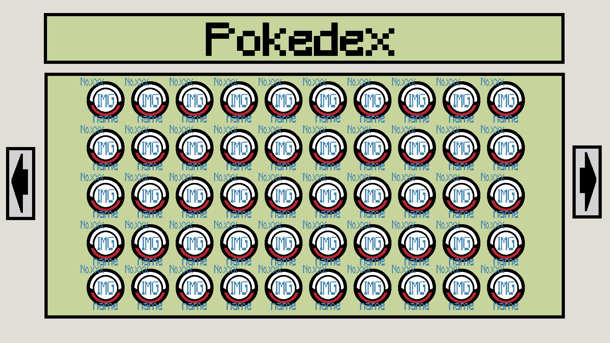
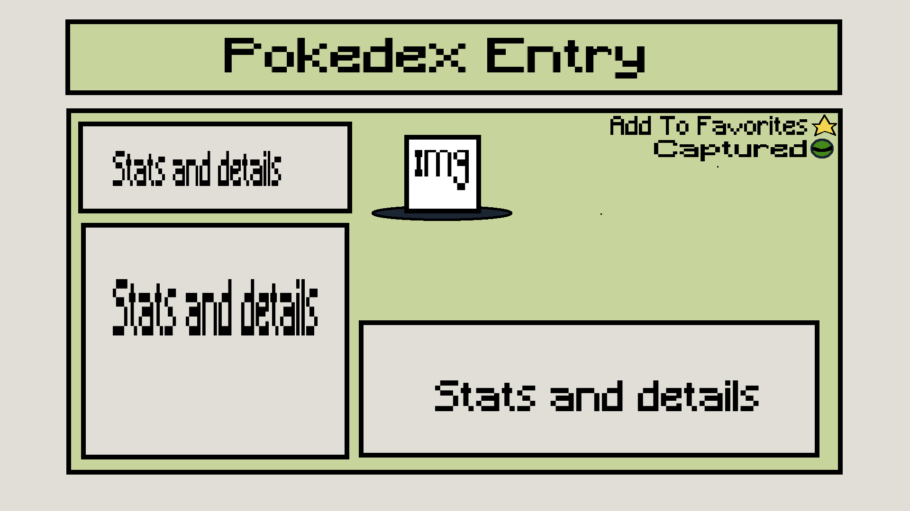
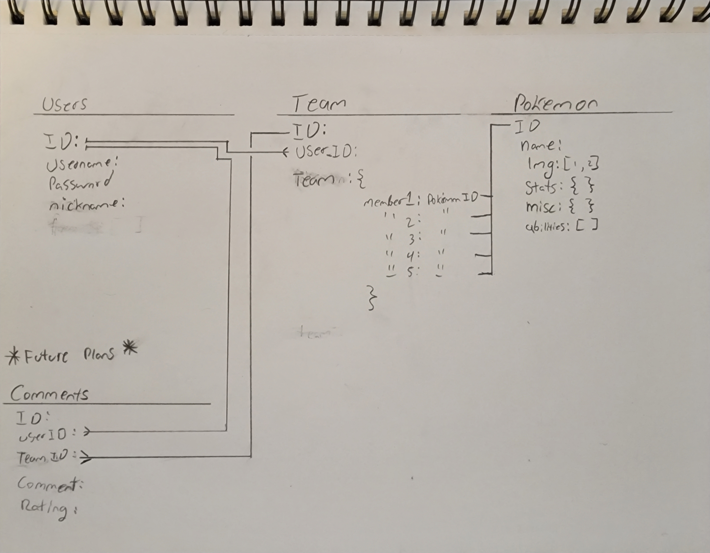

# Title: Pokemon-Tracker

## Premise: 
A Pokemon app for users to track pokemon stats, create teams, and rate teams. 

## The User Story:
- I can see pokemon populate the Pokedex page.
- I can select a pokemon and I go to a page with details on it.
- I can add up to 5 pokemon to a team and save it.
- I can name my teams.

## The Wireframes:
### Pokedex view of pokemon

### Pokedex Entry view of pokemon

### User Profile View

## The ERD: 

## Route Table:

## Technologies Used:

## How To Use:

## MVP Requirements:

## Stretch goals / ICE BOX: